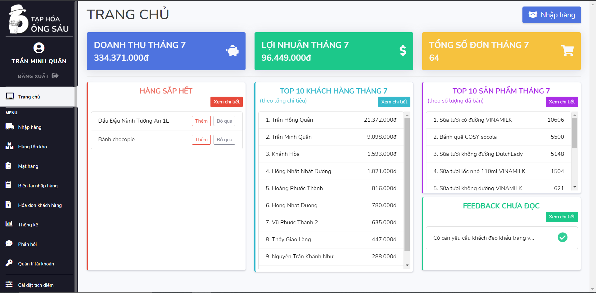
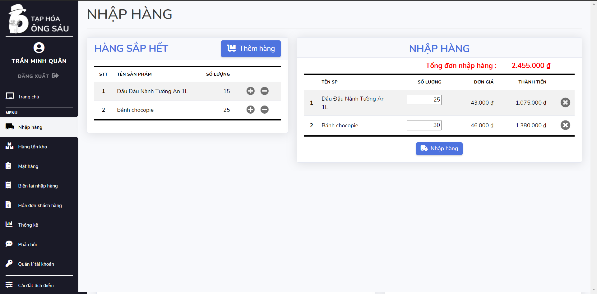

# Grocery Store Management System
## About project:
This project is introduced as a solution for small-to-medium-sized grocery stores in Vietnam. Common grocery stores around Vietnam often encounter some problems such as inventory loss, overwhelming paperwork for inventory management and purchase order or miscalculation, etc. This web-application helps the store owners to deal with the above problems. The website supports the following functionalities for:

## Project user's interface:
### Login screen:

### Cashier role screen:

### Admin's dashboard:

